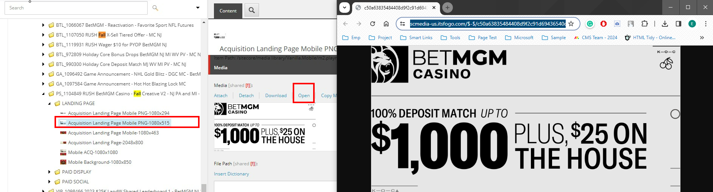
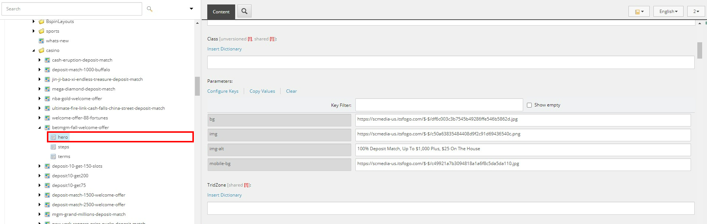
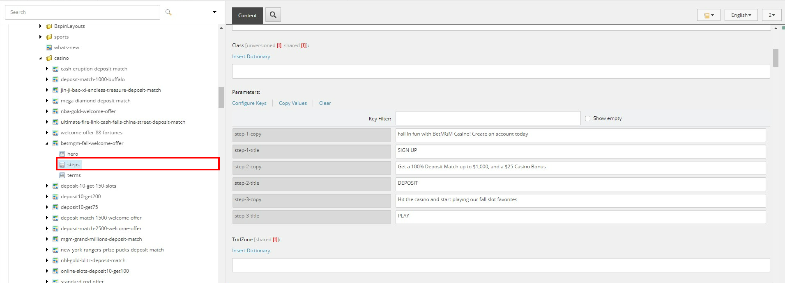
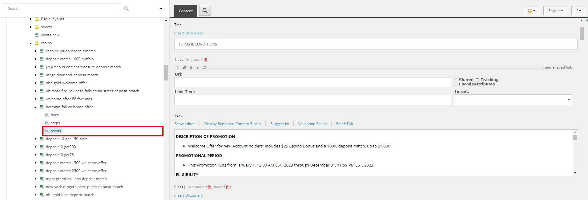
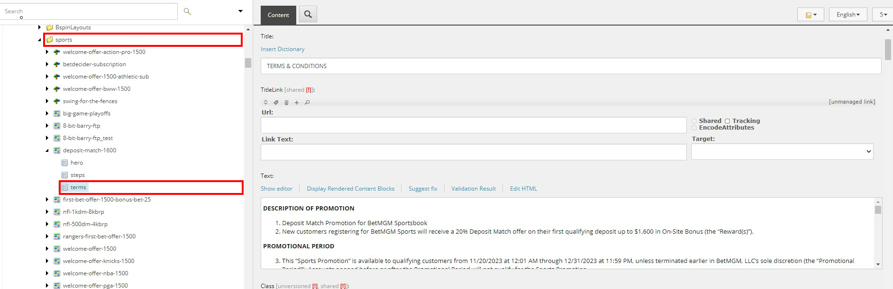

# Landing Page

> :memo:**Sitecore Path:** Content > Vanilla.Mobile > state/brand > Promo > casino or sports or poker

#### Sample Landing Page

## Hero

In this section, you'll edit all images the Landing Page requires. First, you'll need the image URL.

| Key       | Description                                                                                                     |
| --------- | --------------------------------------------------------------------------------------------------------------- |
| bg        | asset with **2048x800** size                                                                                    |
| img       | asset with **1080x515** size, or the **PNG image that includes the brand logo, promo image, and promo details** |
| img-alt   | You can use the **H1 & H2** from the Copy                                                                       |
| mobile-bg | asset with **1080x1080** size                                                                                   |

To get the image URL go to your creatives, **click the asset** you need, then go to media and **click Open**. It will open a new tab showing the asset **copy the URL of the image**.

Then you'll paste the URL on its respective key:

## Steps

Here, you'll insert the Steps [ACQ 1-2-3] from the Copy.

> :warning:**Take Note:** Steps should not have any punctation marks at the end, **except Exclamation Point**.

## Terms

This section is where you'll insert the Terms & Condition of the Promotion. Please mind that in the Landing Page, Titles are in **UPPERCASE, No Colon**, and if its under sports **instead of bullet it should be numbers**.

### Casino

### Sports

