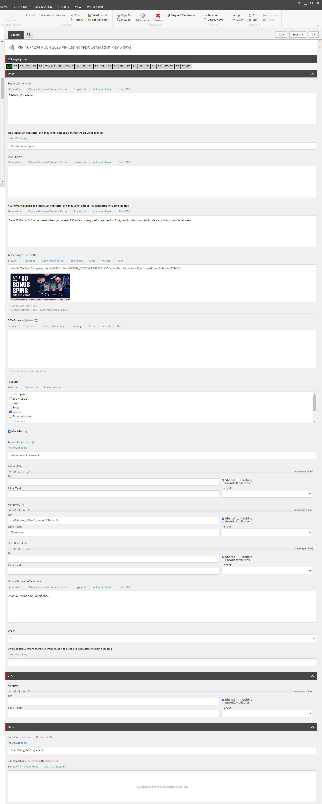

# Static Tile

:::info[SiteCore Path]
sitecore > content > Vanilla.Mobile > state/brand > Promo > PromoHub > OfferTeasers > SpecialOffers > Active > Active > *Casino or Poker or Sports*
:::

The **Static Tile** contains Promohub Tile asset, Promo Title, Promo Description, and CTA/s. Static Tiles are can be found in this URL `https://promo.nj.betmgm.com/en/promo/offers` for BetMGM NJ. Each promo can have its own static tile as seen in the sample below. The highlighted static tile is for Piggy Blitz Bet & Get Promo.

To build a **Static Tile** you'll need the following:  

1. Promo Hub Key Terms (From the copy) H1
2. Promo Hub Key Terms (From the copy) Short Summary
3. Promohub Tiles-800x360 asset
4. CTA/s
5. Offer Badge
6. Filter

Once, you're in the Sitecore Path for builng Static Tile. Do the following:

1. Duplicate any existing OffersTeaser file, and rename it to your Ticket Name.

0. EligibilityCriteriaInfo: `EligibilityCriteriaInfo`
2. Update the Title with the Promo Hub Key Terms H1
3. Update the KeyTermsAndConditions with the Promo Hub Key Terms Short Summary
4. Update the TeaserImage using the Promohub Tiles-800x360 asset uploaded in your Creatives DL
5. For the Produt, make sure the right category is selected if your Tile is under Casino - Casino should be selected.
6. Tick IsHighPriority
7. TeaserClass is always `make-me-look-awesome`
8. PrimaryCTA is where you'll put the CTA if it is **Opt  In**, leave blank if not OPT IN. 
9. MoreInfoCTA is where you'll put the CTA if it is not OPT IN, like Learn More, Play Now, Claim Now
10. ManualTermsAndCondition should only contain `
Manual Terms and Conditions....
`
11. OfferBadge is based on your promo. If its about Deposit Match then the OfferBadge will be **Deposit Match**
12. Clear the Publishing Date, and make sure the **Never Publish** is unticked.

13. Filter, make sure to put your filter for newly build Static Tile. Sample Filter: `QueryString.Get('qa') = 'yourname'`
14. To check your output go to your State's Promotion Page and insert `qa=yourname` at the end of the URL. Sample: `https://promo.nj.betmgm.com/en/promo/offers?qa=yourname`

