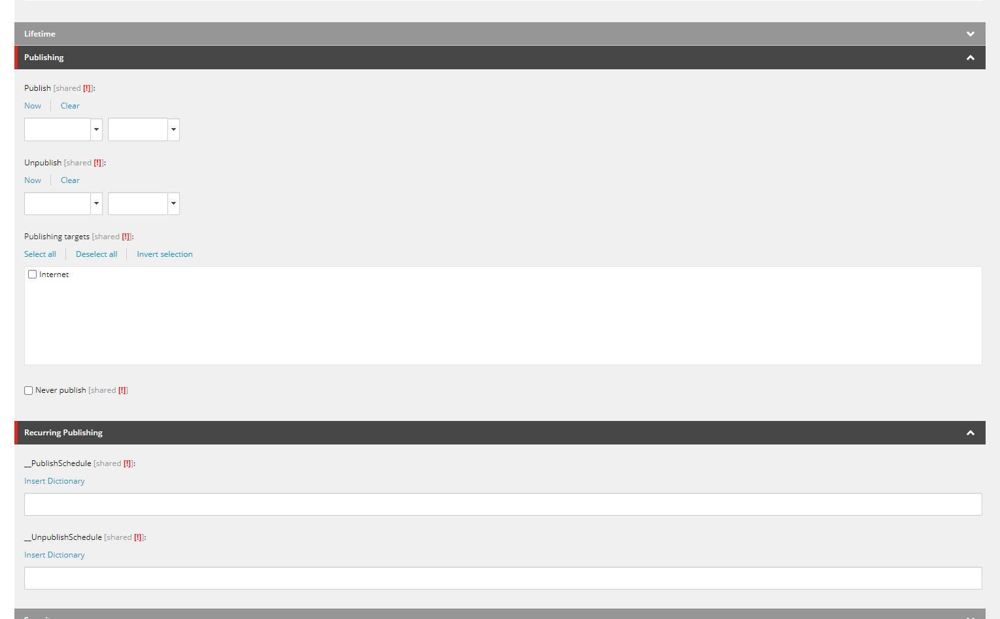

# Static Tile

:::info[SiteCore Path]
sitecore > content > Vanilla.Mobile > state/brand > Promo > PromoHub > OfferTeasers > SpecialOffers > Active > Active > *Casino or Poker or Sports*
:::

The **Static Tile** contains Promohub Tile asset, Promo Title, Promo Description, and CTA/s. Static Tiles are can be found in this URL `https://promo.nj.betmgm.com/en/promo/offers` for BetMGM NJ. Each promo can have its own static tile as seen in the sample below. The highlighted static tile is for Piggy Blitz Bet & Get Promo.

To build a **Static Tile** you'll need the following:  

1. Promo Hub Key Terms (From the copy) H1
2. Promo Hub Key Terms (From the copy) Short Summary
3. Promohub Tiles-800x360 asset
4. CTA/s
5. Offer Badge
6. Filter

Once, you're in the Sitecore Path for builng Static Tile. Do the 
following:

|Label | Desciption | Sample |
|---- |----| ---- |
|1. Duplicate OffersTeaser | Duplicate any existing OffersTeaser file, and rename it to your Ticket Name. | |
|2. EligibilityCriteriaInfo | Paste this on the HTML `EligibilityCriteriaInfo` | |
|3. Title | Insert the Promo Hub Key Terms H1 | |
|4. KeyTermsAndConditions | Insert here the Promo Hub Key Terms Short Summary | |
|5. TeaserImage | Insert the Promohub Tiles-800x360 asset uploaded in your Creatives DL | |
|6. Produt | Make sure the right category is selected if your Tile is under Casino - Casino should be selected. ||
|7. IsHighPriority | Ticked this ✅||
|8. TeaserClass | Input `make-me-look-awesome` ||
|9. PrimaryCTA | Put the CTA if it is **Opt  In**, leave blank if not OPT IN. ||
|10. MoreInfoCTA | Put the CTA if it is not OPT IN, like Learn More, Play Now, Claim Now ||
|11. ManualTermsAndCondition | Should only contain `
Manual Terms and Conditions....
` ||
|12. OfferBadge | Depends on your Promo Type. If its about Deposit Match then the OfferBadge will be **Deposit Match**||
|13. Filter > Condition | Make sure to put your filter for newly build Static Tile. Sample Filter: `QueryString.Get('qa') = 'yourname'`||
|14. Publishing Section | Clear the Publishing Date, and make sure the **Never Publish** is unticked. | |
|15. Screenshot Output | To check your output go to your State's Promotion Page and insert `qa=yourname` at the end of the URL. Sample: `https://promo.nj.betmgm.com/en/promo/offers?qa=yourname` |

